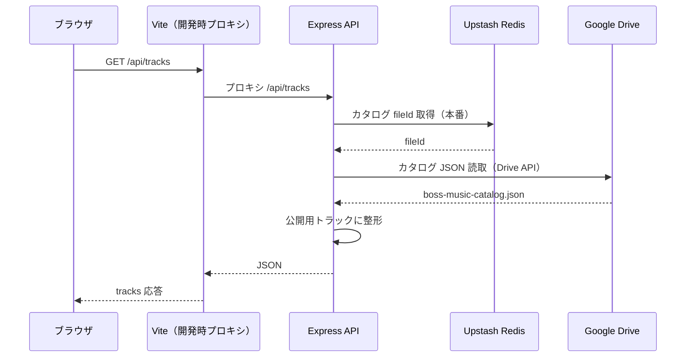
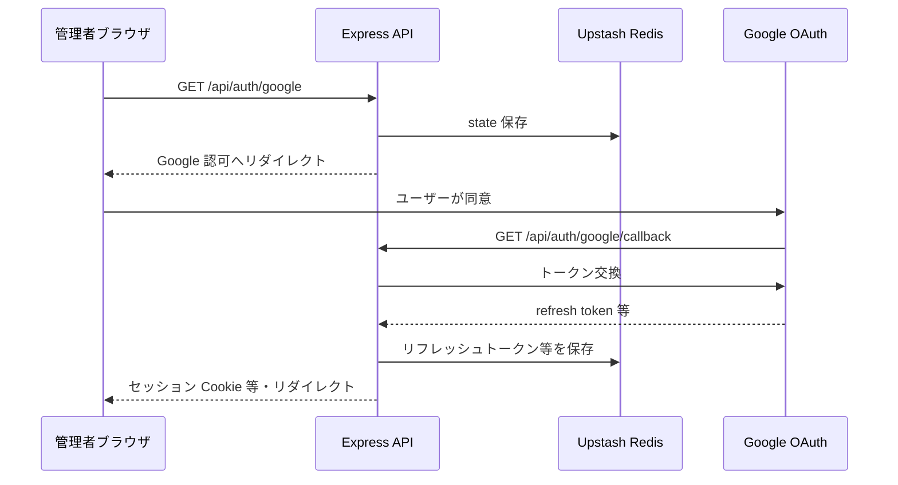
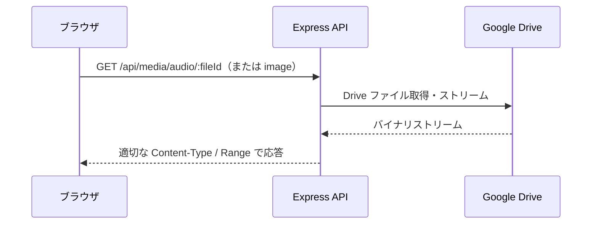
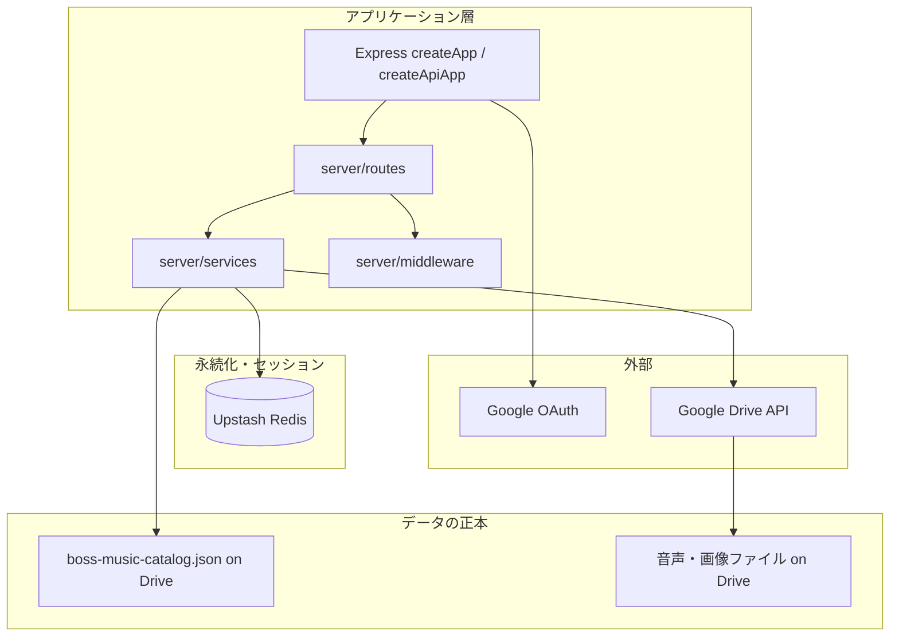

# バックエンド構成（Mermaid 図と解説）

boss-music のサーバー側を、代表フローで整理したものです。詳細は `アーキテクチャ.md` / `技術スタック.md` を正とします。

---

## 1. 公開トラック一覧（`GET /api/tracks`）

開発時は Vite が `/api` を Express にプロキシし、本番（Vercel）では静的配信と別に Serverless の `createApiApp()` が `/api/*` を処理します。

### 解説

- **ブラウザ**はフロント（React）から `fetch('/api/tracks')` のように API を呼びます。
- **開発時**はポートが分かれているため、Vite のプロキシで `/api` が Express（例: `:8787`）に転送され、同一オリジンに近い挙動になります。
- **本番（Vercel）**ではフロントは CDN 経由の静的ファイル、API は `api/index.mjs` の Express `createApiApp()` が担当します（アーキテクチャ図のとおり）。
- **Upstash Redis**には、OAuth 関連に加え、カタログ JSON の **fileId** などが保存されます（環境・設定により、カタログ ID の出所は異なり得ます）。
- **Google Drive**上の **`boss-music-catalog.json`** が曲メタと Drive ファイル ID の正本です。RDB は使っていません。
- Express は Drive から取得した JSON を **`toPublicTrack` 等で公開形**にして返します。

---

## 2. Google OAuth（Drive 連携の開始〜コールバック）

管理者が Google と連携し、リフレッシュトークンをサーバー側に保存するまでのイメージです。

### 解説

- **state** は CSRF 対策用に Redis 等に保持されます。
- **リフレッシュトークン**は Drive API 用にサーバー側へ保存され、本番では **Redis への永続化**が前提です。
- コールバック後、**管理者向け Cookie** などで管理画面のセッションが確立されます（詳細は `server/middleware/adminAuth.ts` 側）。

---

## 3. メディア配信（`GET /api/media/audio|image/:fileId`）

ブラウザは公開 API 経由で Drive 上のファイルをストリーム取得します（Range 対応）。

### 解説

- 音声・画像の**実体**は Drive 上にあり、API は **中継**します。
- **Range** によりシーク再生などに対応します（アーキテクチャ記載どおり）。

---

## 4. バックエンドの細分化（概念図）

「バックエンド」一語に含まれる要素の関係を、部品として示します。

### 解説

- **Express**は HTTP の入口であり、`routes` がパス、`services` が Drive・カタログ・Redis などの**ドメインロジック**を呼び出します。
- **Redis**は RDB の代替ではなく、**トークン・state・カタログ fileId** などの **KV ストア**として機能します。
- **業務データの中心**は **Drive 上の JSON カタログ**です。
- **認証**は Google OAuth と、管理 API 向けの **Cookie / X-Admin-Secret** などに分かれます。
- **デプロイ**（ローカル分離・単一プロセス・Vercel Serverless）は「同じコードの載せ方の違い」であり、上記の部品構成と直交します。
