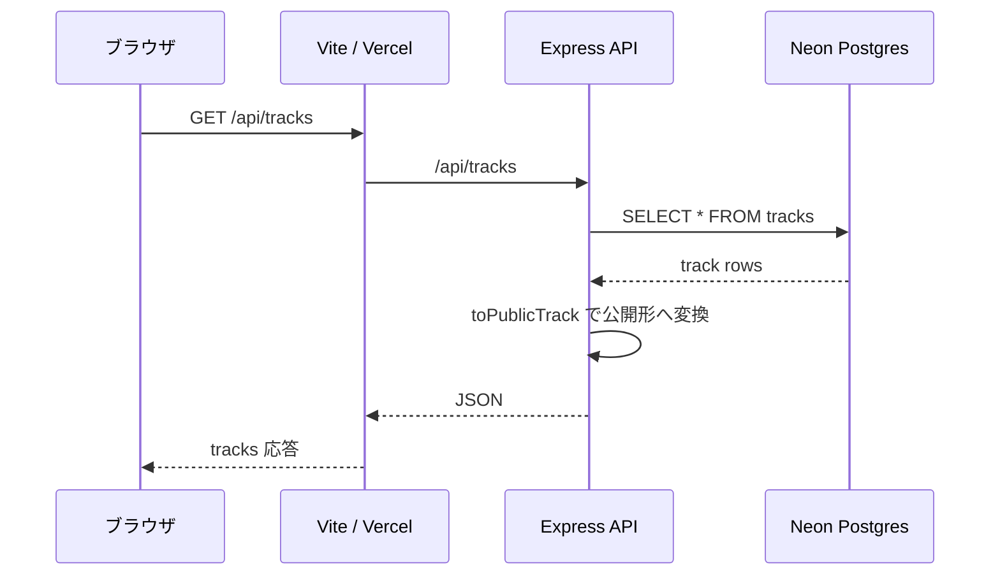
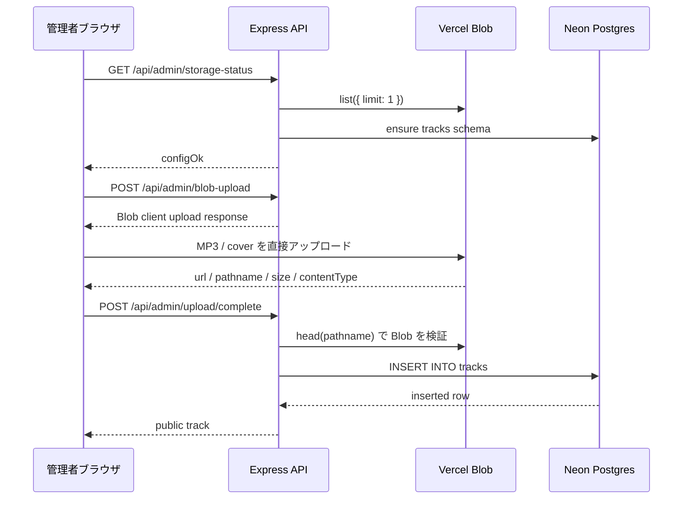
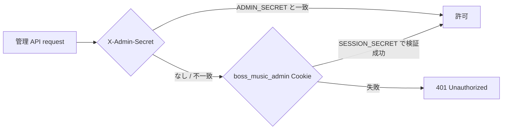
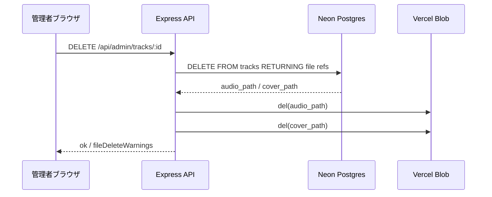
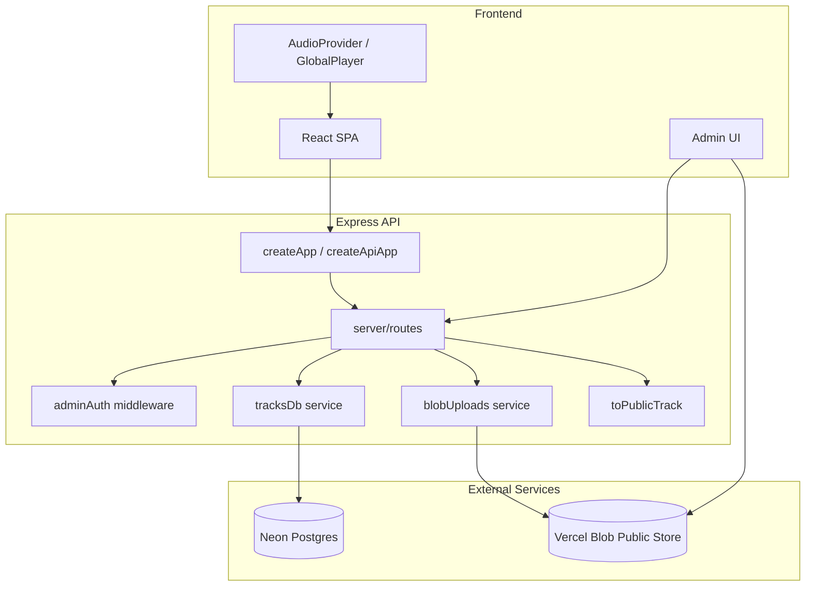

# バックエンド構成（Mermaid 図と解説）

最終更新: 2026-04-24
現行構成: Vercel Blob + Neon Postgres

詳細な説明は `アーキテクチャ.md` / `技術スタック.md` を正とします。

---

## 1. 公開トラック一覧（`GET /api/tracks`）

### 解説

- 開発時は Vite が `/api` を Express `:8787` にプロキシする。
- 本番 Vercel では `/api/*` が `api/index.mjs` の Express `createApiApp()` に rewrite される。
- 曲情報の正本は Neon Postgres の `tracks` テーブル。
- 返却される `audioUrl` / `coverImage` は Vercel Blob の公開 HTTPS URL。

---

## 2. 管理アップロード（ブラウザ直 Blob）

### 解説

- MP3 を Vercel Function に丸ごと送らない。ブラウザが Vercel Blob へ直接アップロードする。
- API はアップロード済み Blob の metadata を検証してから Neon に登録する。
- `tracks/{uuid}/audio-*.mp3`、`tracks/{uuid}/cover-*.(jpg|jpeg|png|webp)` の pathname だけを許可する。
- 旧 `/api/admin/upload` multipart 経路は `410 Gone`。

---

## 3. 管理者認証

### 解説

- ローカル開発では `VITE_ADMIN_SECRET` に `ADMIN_SECRET` と同じ値を入れると、管理画面から自動で `X-Admin-Secret` を送れる。
- 本番で `VITE_ADMIN_SECRET` を埋め込むのは非推奨。フロントに入る `VITE_*` は公開値として扱う。
- `SESSION_SECRET` が 16 文字以上なら `/api/admin/session` で HttpOnly Cookie を発行できる。

---

## 4. トラック削除

### 解説

- DB レコード削除後、対応する Blob も削除する。
- Blob 削除に失敗した場合は `fileDeleteWarnings` で返す。
- `?keepFiles=1` を付けると Blob 削除をスキップできる。

---

## 5. 部品構成

### 解説

- Express は HTTP の入口。
- `routes` は API パスごとの制御を担当する。
- `services/tracksDb.ts` は Neon schema / CRUD を担当する。
- `services/blobUploads.ts` は Vercel Blob の検証・削除を担当する。
- 音声と画像は Public Blob URL をフロントが直接読む。
